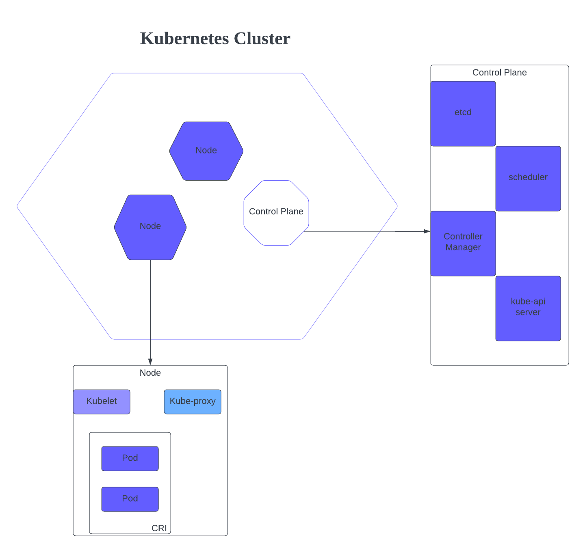

# Kubernetes
### Study notes and lab work in preparation for the CKA exam
<h2>Resources</h2>

  <ul>
    <li>https://kubernetes.io/docs/tutorials/kubernetes-basics/</li>
    <li>https://www.freecodecamp.org/news/the-kubernetes-handbook/</li>
    <li>https://youtu.be/s_o8dwzRlu4?si=0ETpts53_m0569nG</li>
    <li>https://roadmap.sh/kubernetes</li>
    <li>Kubernetes for Absolute Beginners by Mumshad Mannambeth</li>
    <li>Kubernetes Example: https://github.com/kodekloudhub/example-voting-app-kubernetes</li>
  </ul>

<h2>Why Containers?</h2>

  <ul>
    <li>Containers are independent environments with their own networking and mounts just like VMs but they share the same Kernel.</li>
    <li>Containers allows you to modify components without having to modify the underlying OS.</li>
    <li>Docker containerizes applications to ship and run them. Docker containers are lightweight and fast.</li>
    <li>Docker image - a package or template used to create containers.</li>
  </ul>

<h2>What is Kubernetes?</h2>

  <ul>
    <li>Kubernetes or K8s, is an open source container orchestrator tool</li>
    <li>Helps you manage thousands of applications</li>
    <li>Provides high availability, scalability, and disaster recovery</li>
    <li>Can be deployed on either physical or virtual machines</li>
    <li>Places containers into Pods to run on Nodes.</li>
  </ul>

<h2>Kubernetes Architecture</h2>

  <ul>
    <li>Control Plane - Manages the cluster and the nodes that are used to host the running applications</li>
    

    <ul>
      <li>API Server - This is the entry point to K8s cluster</li>
      <li>Controller Manager - keeps tracks of whats happening in the cluster</li>
      <li>Scheduler - decides on which node the new pod should be scheduled.</li>
      <li>etcd - key value store for backup and recovery</li>
      <li>cloud-controller-manger - allows you to link a cluster into a cloud provider's API</li>
    </ul>
  

    </ul>
    <ul>
    <li>Node: Virtual or physical machine managed by the control plane.Components of the node: kubelet, container runtime, kube-proxy. The name of a Node, must be a valid DNS subdomain name. You can create and modify node objects using kubectl.</li>
      

        <ul>
          <li>Master Node & Worker Node</li>
            <ul>
              <li>Worker Node: Hosts containers, CRI-O, kubelet</li>
              <li>Master Node: kube-apiserver, etcd, controller, scheduler</li>
            </ul>
          <li>Container Runtime Interface (CRI) - plugin interface which enables the kubelet to use a wide variety of container runtimes. One is needed on each node in your cluster.</li>
          <li>kubelet - agent that runs on each node</li>
          <li>kube-proxy - network proxy that runs on each node in your cluster. The proxy maintains network runs on nodes and allows communication to Pods fron inside and outside of the cluster</li>
          <li>kubectl - deploys and manages applications on a K8s cluster.</li>
        </ul>
      

    </ul>
  </ul>

        
  -------------------------------------------------------------------------------------------------------------------------      
  -------------------------------------------------------------------------------------------------------------------------      
        
  <h2>KodeKloud Lab</h2>

  <ul>
      <li>Log into the Google cloud platform and navigate to the Kubernetes Engine.</li>
    

    <li>Since this was my first time creating a resource in GCP, I was given a low cost Cluster to use.</li>
    

  </ul>

